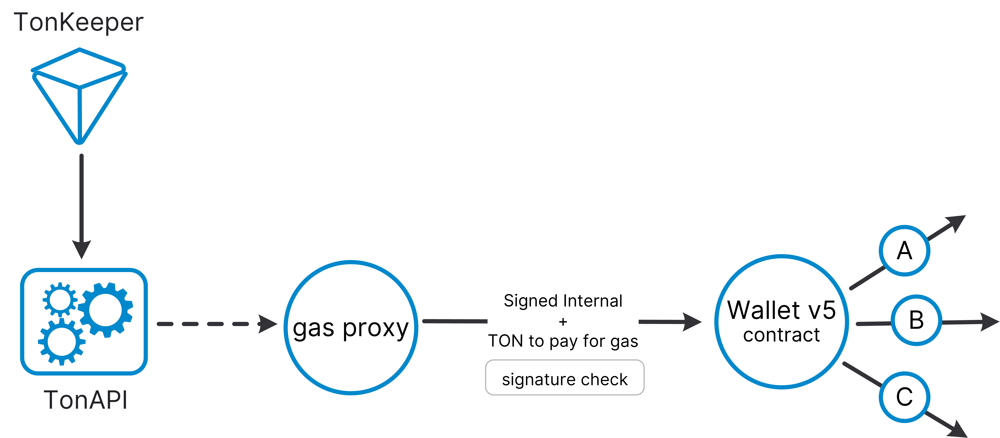

# TON Wallet Batch Generator

TON based application for quick and easy wallet batch generation. The application generates v4 and v5 versions of wallets, as well as private and public keys and seed phrase (mnemonic phrase).

## Types of Wallet
- Explore the key differences between v4 and v5 https://docs.ton.org/participate/wallets/contracts


## Install

```
git clone https://github.com/roma-marshall/ton-batch-wallet.git
cd ton-batch-wallet
npm run dev
```

## License

MIT License
